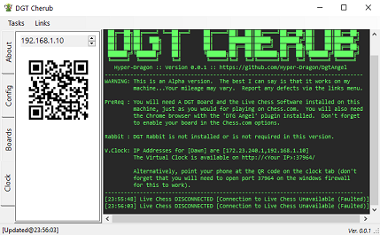

# DGT Angel

'Ultimate' might be a bit of a stretch since this is very much an Alpha version.  The best I can say is that it works on my machine...Your mileage may vary but if you do have any issues see the [Support Section](#Software-Support) below.  

It is designed to be be a **passive addition to the play experience** and does not directly interact with any web sites directly to work.  Think of it as nothing more than a casual observer.  An observer that will let you know if your board is out of sync with the screen and how much time you have left.

For a distraction free experience use the 'virtual clock' from your phone.  Almost just like playing OTB.

## Supported Page(s)

- [The Chess.com Live Board](https://www.chess.com/live)¹

¹ *The live board is being retired at some point Later this year.  The code has already been written to support the play board but is not included in this release.*

## Prerequisites

If you just want the voice support you only need the Chrome plugin and the Cherub client.  Seems like overkill but the option is there. Otherwise keep reading...

### Miniumum

- A DGT Board
- Windows¹
- A Chrome web browser
- The DGT Live Chess Software²
- ~~The DGT Rabbit Plugin~~³
- 'Dgt Angel' - The chrome extension
- 'Dgt Cherub' - The windows client  
- Don't forget to enable your board in the Chess.com options.

¹ *The client currently requires windows to run*
² *As required by chess.com*
³ *Not required in this version*

## Setup

It looks like a lot but it isn't really.  If you already play on chess.com with your board then you are almost good to go.

### DGT Angel Plugin

This is the Chrome Extension...Just go and download it from google.

### DGT Cherub

Download the .zip file from the [releases page](https://github.com/Hyper-Dragon/DgtAngel/releases), extract it and double click *Cherub.exe* to run.

### Virtual Clock

The Virtual Clock runs from the client and is available on `http://*Your IP*:37964/`.  For this to work you will need to open port 37964 on your windows firewall.

``` PowerShell
# Add Rule
netsh advfirewall firewall add rule name="Dgt Angel ALLOW Tcp Port 37964" dir=in action=allow protocol=TCP localport=37964

# Check Rule
netsh advfirewall firewall show rule name="Dgt Angel ALLOW Tcp Port 37964"

# Delete Rule
netsh advfirewall firewall delete rule name="Dgt Angel ALLOW Tcp Port 37964"
```

You can access your clock by pointing your phone/tablet at the QR code on the clock tab.



[Link MD TEST no extension](about)

## Software Support

Report any defects on the project [issues page](https://github.com/Hyper-Dragon/DgtAngel/issues/new/choose).

## Donate

This software was written by me, initially for me.  I decided to put in the extra work required to make it available to you.  If you use it regularly then please consider supporting the project with a donation.  No pressure.

- **[Donate via Github](https://github.com/sponsors/Hyper-Dragon)**
  